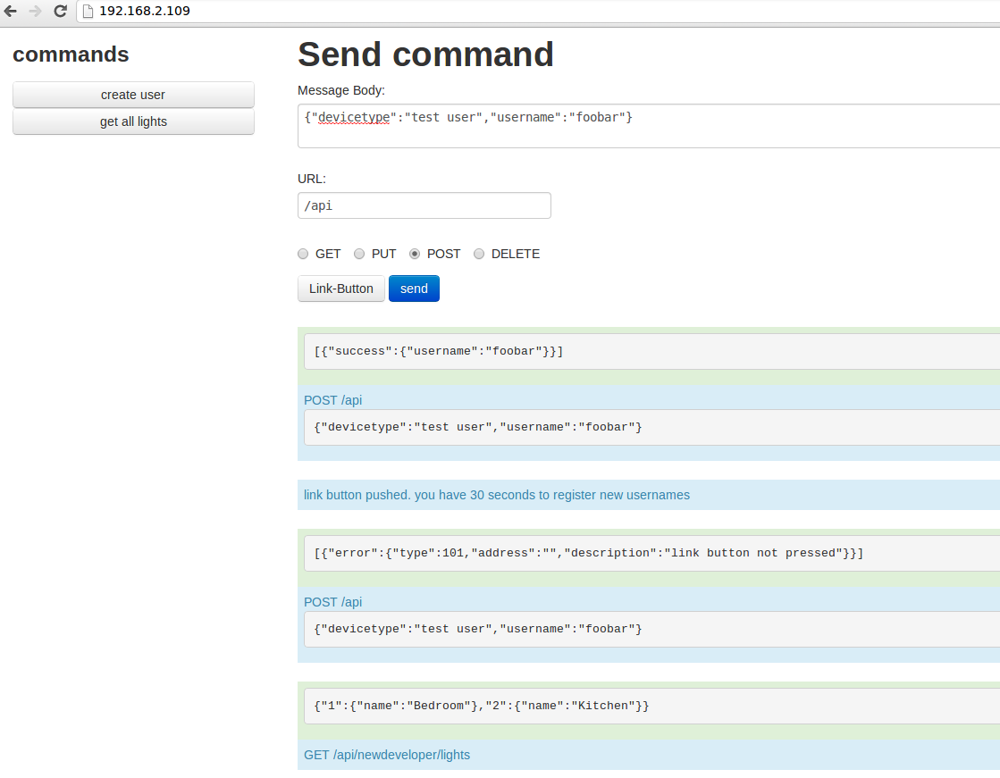

# A node.js based simulator for the Philips Hue API

As I started development of hueJS before getting my Hue starter kit, i needed to test my code with a simulated bridge.

## Install

Using npm:

```
sudo npm install -g hue-simulator
```

It should be installed [globally](http://blog.nodejitsu.com/npm-cheatsheet#Understanding_Global_versus_Local_installs_in_npm) by default, so you can start the simulator via command line, but to be sure we are adding the `-g` flag.

## Run

Start the simulator via command line:
```
sudo hue-simulator
```
Sudo is necessary because we want to listen on port 80.

## Debugger

Like a real bridge, you have a webinterface where you can enter commands. After starting the simulator, simply navigate your browser to the IP of the simulator.

In the list on the left, you have predefined commands, so you don't always have to look up the correct URL and write the whole JSON-body of the message. Click on a button, and the command-form is filled with dummy data for this kind of command.

## Routes

`GET /linkbutton` will enable user registration for 30 seconds.

`GET /api/:username` will return the current full state if the user is already registered, or error, it the user is unknown:
```
// success
{
            "lights": {
                "1": {
                    "state": {
                        "on": false,
                        "bri": 0,
                        "hue": 0,
                        "sat": 0,
                        "xy": [0.0000, 0.0000],
                        "ct": 0,
                        "alert": "none",
                        "effect": "none",
                        "colormode": "hs",
                        "reachable": true
                    },
                    "type": "Extended color light",
                    "name": "Hue Lamp 1",
                    "modelid": "LCT001",
                    "swversion": "65003148",
                    "pointsymbol": {
                        "1": "none",
                        "2": "none",
                        "3": "none",
                        "4": "none",
                        "5": "none",
                        "6": "none",
                        "7": "none",
                        "8": "none"
                    }
                },
                "2": {
                    "state": {
                        "on": true,
                        "bri": 254,
                        "hue": 33536,
                        "sat": 144,
                        "xy": [0.3460, 0.3568],
                        "ct": 201,
                        "alert": "none",
                        "effect": "none",
                        "colormode": "hs",
                        "reachable": true
                    },
                    "type": "Extended color light",
                    "name": "Hue Lamp 2",
                    "modelid": "LCT001",
                    "swversion": "65003148",
                    "pointsymbol": {
                        "1": "none",
                        "2": "none",
                        "3": "none",
                        "4": "none",
                        "5": "none",
                        "6": "none",
                        "7": "none",
                        "8": "none"
                    }
                }
            },
            "groups": {
                "1": {
                    "action": {
                        "on": true,
                        "bri": 254,
                        "hue": 33536,
                        "sat": 144,
                        "xy": [0.3460, 0.3568],
                        "ct": 201,
                        "effect": "none",
                        "colormode": "xy"
                    },
                    "lights": ["1", "2"],
                    "name": "Group 1"
                }
            },
            "config": {
                "name": "Philips hue",
                "mac": "00:00:88:00:bb:ee",
                "dhcp": true,
                "ipaddress": "192.168.1.74",
                "netmask": "255.255.255.0",
                "gateway": "192.168.1.254",
                "proxyaddress": "",
                "proxyport": 0,
                "UTC": "2012-10-29T12:00:00",
                "whitelist": {
                    "newdeveloper": {
                        "last use date": "2012-10-29T12:00:00",
                        "create date": "2012-10-29T12:00:00",
                        "name": "test user"
                    }
                },
                "swversion": "01003372",
                "swupdate": {
                    "updatestate": 0,
                    "url": "",
                    "text": "",
                    "notify": false
                },
                "linkbutton": false,
                "portalservices": false
            },
            "schedules": {
                "1": {
                    "name": "schedule",
                    "description": "",
                    "command": {
                        "address": "/api/0/groups/0/action",
                        "body": {
                            "on": true
                        },
                        "method": "PUT"
                    },
                    "time": "2012-10-29T12:00:00"
                }
            }
        }
```
```
[
    {
        error: {
            type: 1,
            address: '/',
            description: 'unauthorized user'
        }
    }
]
```


`POST /api` with parameters `username` and `devicetype` will register the user, if the linkbutton has been pressed, or an error, if the button is not pressed:
```
[
    {
        success: {
            username: 'icanhazusername'
        }
    }
]
```
```
[
    {
        error: {
            type: 101,
            address: '',
            description: 'link button not pressed'
        }
    }
]
```
